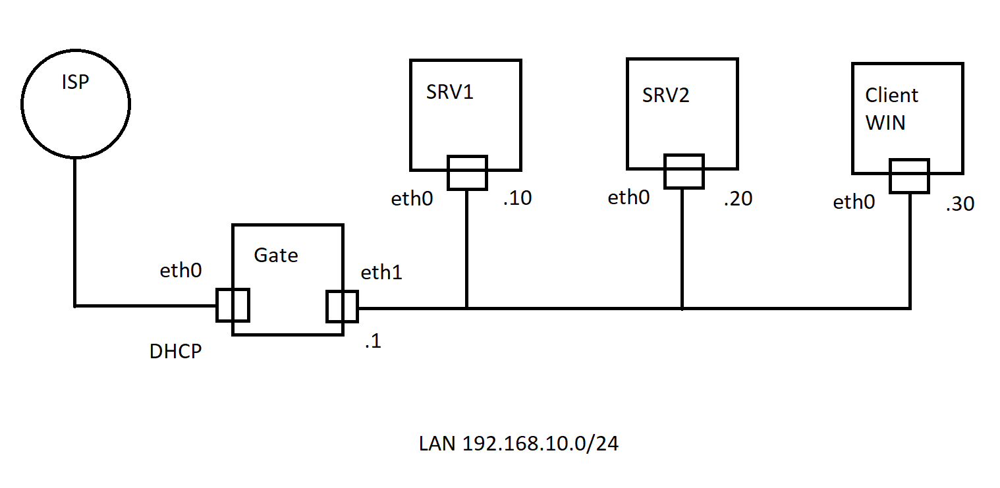

# 1. Схема стенда



# 2.Создание виртуальных машин в виртуализации
Шаг 1. Импорт VM

* Импорт 4 виртуальных машин с Debian и MS

* Открыть  Hyper-V Manager

* В action выбрать import Virtual Machine...
```
3 машины без графики
1 машинf с Microsoft Windows
```
* или у вас уже будут импортированы.

Шаг 2. Создание switch

Открыть  Hyper-V Manager

В action выбрать Virtual Switch Manager...
```
New virtual network switch
  internal
  Create virtual switch
```
Шаг 3. Переименование вируальных машин

```
Переименовать Debian 1 в Gate
Переименовать Debian 2 в SRV1
Переименовать Debian 1 в SRV2
Переименовать Windows server в Client
```

Шаг 4. Подключение сетевых карт в виртуальных машинах

Настройка на хосте Ip address 192.168.30.5 / 24

Открыть настройки Gate

1. Добавить Network Adapter
2. 1 network adapter подключить к External network
3. 2 network adapter подключить к Internal network

Для всех остальных изменить настройки network adapter на internal network

запустить все 4 машины

Подключиться к Gate по SSH

User Root

Password Pa$$w0rd

Настроить сетевые адреса
```
# nano /etc/network/interfaces
```
Проверить и добавить

```
auto eth0
iface eth0 inet dhcp

auto eth1
iface eth1 inet static
address 192.168.10.1/24

```

изменить имя компьютера
```
hostnamectl set-hostname  gate

```
Настройка hosts
```bash
# nano /etc/hosts
```
```
127.0.0.1               localhost
127.0.1.1                gate.corp.ru gate

192.168.10.1 gate.corp.ru gate
192.168.10.10 srv1.corp.ru srv1
192.168.10.20 srv2.corp.ru srv2
192.168.10.30 client.corp.ru client
```

Редактирование Resolv
```
nano /etc/resolv.conf
```
```
search corp.ru
nameserver 8.8.8.8
```

перезапустить сетевые адаптеры
```
systemctl restart networking
```

Подключиться к svr1
User Root
Password Pa$$w0rd

Настроить сетевые адреса
```
# nano /etc/network/interfaces
```
Проверить и добавить

```
auto eth0
iface eth0 inet static
address 192.168.10.10/24
gateway 192.168.10.1


```

изменить имя компьютера
```
hostnamectl set-hostname  svr1

```
Настройка hosts
```
# nano /etc/hosts
```
```
127.0.0.1               localhost
127.0.1.1                srv1.corp1.ru srv1

192.168.30.1 gate.corp1.ru gate
192.168.30.10 srv1.corp1.ru srv1
192.168.30.20 srv2.corp1.ru srv2
192.168.30.30 client.corp1.ru client
```

Редактирование Resolv
```
nano /etc/resolv.conf
```
```
search corp1.ru
nameserver 8.8.8.8
```

перезапустить сетевые адаптеры
```
systemctl restart networking
```
   
Подключиться к svr2
User Root
Password Pa$$w0rd

Настроить сетевые адреса
```
# nano /etc/network/interfaces
```
Проверить и добавить

```
auto eth0
iface eth0 inet static
address 192.168.30.20/24
gateway 192.168.30.1

```

изменить имя компьютера
```
hostnamectl set-hostname  svr2

```

Настройка hosts
```
# nano /etc/hosts
```
```
127.0.0.1               localhost
127.0.1.1                srv2.corp1.ru srv2

192.168.30.1 gate.corp1.ru gate
192.168.30.20 srv1.corp1.ru srv1
192.168.30.21 srv2.corp1.ru srv2
192.168.30.101 client.corp1.ru client
```

Редактирование Resolv
```
nano /etc/resolv.conf
```
```
search corp1.ru
nameserver 8.8.8.8
```
перезапустить сетевые адаптеры
```
systemctl restart networking
```

Запустить сервер Microsoft

Установите настройки сети 
```
192.168.30.101
255.255.255.0
192.168.30.1

DNS 192.168.30.1
```

Перезагрузить Linux server

```
reboot
or
init 6
```

Проверить
все настройки сети 

```
ip a
ip r
```

С gate проверить интернет
```
ping -c4 8.8.8.8
```

Настроить Putty

Добавить 3 linux в Putty


